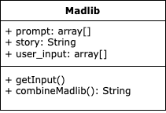

# MAD LIBS Generator

**USE CASE:** Create stories based on user-input

## Definition of terms:
_Madlib_
- random word to be used in the story
_Story_
- hidden content to be revealed once madlibs have been supplied
_Prompt_
- asks for user input

Stage 1:
Main Success Scenario:
* User madlinbs input are stored
* User "madlibs" are displayed

Functional Requirements:
* user input is stored
* stored user input used as "madlib" in story

Implementation:

* prompts in the Story String are to be represented with {#} for easier String replacement
* size of prompt array equals size of user_input array
